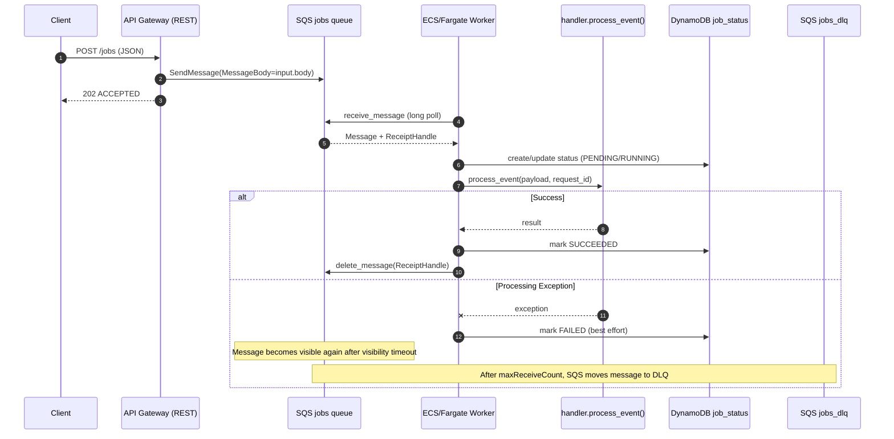
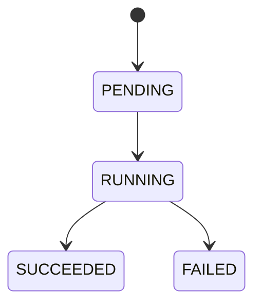
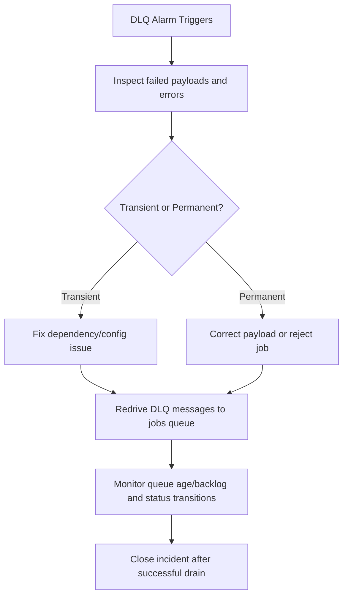

# AWS Async Architecture (Detailed)

This document describes the deployed async architecture for the OpenFaaS migration, including route behavior, queue processing, state management, monitoring, and DLQ reprocessing.

## 1) End-to-End Request Route

1. Caller sends `POST /jobs` with a JSON payload.
2. API Gateway REST API receives the request.
3. API Gateway uses AWS service integration to call SQS `SendMessage`.
4. SQS `jobs` queue stores the payload.
5. ECS/Fargate worker (`sqs_worker.py`) long-polls and receives the message.
6. Worker calls shared business logic (`process_event()` in `handler.py`).
7. Worker updates DynamoDB status table (`job_status`).
8. On success, worker deletes the SQS message.
9. On processing exception, message is retried by SQS and eventually moved to DLQ after `maxReceiveCount`.



## 2) API Gateway to SQS Integration Details

- Route: `POST /jobs`
- Integration type: API Gateway -> AWS service (SQS)
- Mapping template:

```
Action=SendMessage&MessageBody=$util.urlEncode($input.body)
```

- Response semantics: accepted/async (`202` style contract)

## 3) Queueing and Processing Semantics

- Primary queue: `jobs`
- DLQ: `jobs_dlq` via `redrive_policy`
- Worker runtime: `openfaas-functions/openfaas-aws-migration/sqs_worker.py`
- Processing characteristics:
  - long polling (`WaitTimeSeconds`)
  - visibility timeout configured for long-running jobs
  - configurable message batch size
  - malformed payloads are treated as non-retryable and deleted
  - processing exceptions are retryable (message not deleted)

## 4) Job State Model (DynamoDB)

Status table is used to track async lifecycle by `job_id`.



Typical status fields:

- `job_id` (partition key)
- `status` (`PENDING`, `RUNNING`, `SUCCEEDED`, `FAILED`)
- `submitted_at`, `started_at`, `completed_at`, `updated_at`
- `outcome_code`
- `result` (on success) or `error_message` (on failure)

## 5) Monitoring, Alerting, and Scaling

### CloudWatch alarms

- Queue backlog (`ApproximateNumberOfMessagesVisible`)
- Oldest message age (`ApproximateAgeOfOldestMessage`)
- DLQ has messages (`jobs_dlq` visible messages > 0)

### Autoscaling

- ECS service desired count scales from SQS backlog thresholds (scale out/in policies).

### Logs

- Worker logs to CloudWatch log group `/ecs/<name_prefix>`.

## 6) DLQ Reprocessing (Operational Flow)

DLQ is the safety boundary for messages that exceeded retry limits.



Recommended redrive options:

- SQS redrive task from DLQ to source queue
- controlled/scripted replay from DLQ to `jobs` queue
- rate limit replay during incident recovery to avoid worker saturation

## 7) Notes for Architecture Reviews

- This is an async-first design: HTTP is submission only, not compute execution.
- Reliability comes from queue buffering, retries, and DLQ isolation.
- Throughput comes from worker autoscaling and decoupled processing.
- Status visibility comes from DynamoDB lifecycle tracking.
