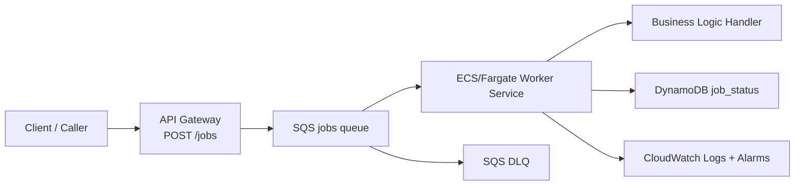

# AWS Service Flow (High Level)

This is the executive-level view of services and data flow.

## Super High-Level Service Diagram

## Simplified Narrative

1. Client submits a job to API Gateway.
2. API Gateway places the payload onto SQS.
3. ECS/Fargate workers pull from SQS and process jobs.
4. Workers update DynamoDB with job state.
5. CloudWatch tracks queue health, DLQ signals, and worker logs.
6. Messages that repeatedly fail are isolated in DLQ for reprocessing.

## What each service does (one-liner)

- **API Gateway**: public ingestion endpoint (`POST /jobs`).
- **SQS jobs**: durable async buffer between API and compute.
- **ECS/Fargate worker**: scalable background processors.
- **Handler logic**: application-specific job execution.
- **DynamoDB job_status**: async lifecycle and outcomes.
- **SQS DLQ**: failed-message quarantine.
- **CloudWatch**: observability, alarms, and autoscaling signals.
